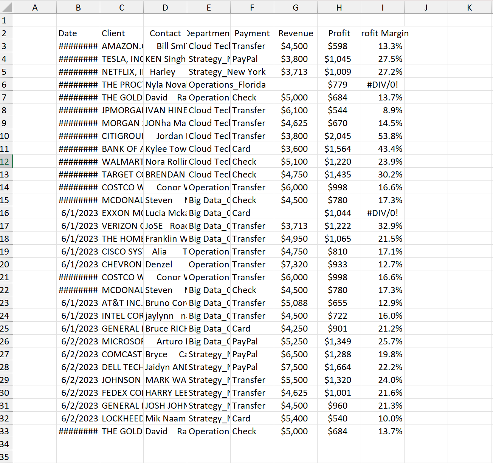

# 🧹 Excel Data Cleaning Project

## 📌 Project Overview

This project demonstrates **data cleaning in Microsoft Excel** using a business dataset containing client information, revenue, profit, and payment details.

The raw dataset contained inconsistent text formatting, extra spaces, mixed information within columns, missing values, and formula errors. The objective was to clean and organize the dataset to make it ready for data analysis and visualization.

---

## 📂 Dataset

The dataset contains the following columns:

- Date
- Client
- Contact
- Department
- Payment
- Revenue
- Profit
- Profit Margin

### Issues Identified

- Extra stock exchange codes in the Client column
- Inconsistent text capitalization
- Extra spaces in names
- Department and City combined in one column
- Missing values
- Formula errors (`#DIV/0!`)
- Poor worksheet formatting

---

# 🛠 Data Cleaning Steps

## 1. Improved Worksheet Readability

Auto-fitted all rows and columns to ensure that every value was clearly visible.

**Excel Feature Used**

- Home → Format → AutoFit Column Width
- Home → Format → AutoFit Row Height

---

## 2. Removed Unnecessary Stock Exchange Codes

The Client column contained stock exchange identifiers such as:

**Before**

```
AMAZON.COM, INC. (XNAS:AMZN)
```

**After**

```
amazon.com, inc.
```

**Excel Feature Used**

```
Find & Select → Replace

Find:
(*)

Replace With:
(blank)
```

---

## 3. Standardized Client Names

Converted all company names into lowercase for consistency.

**Excel Function Used**

```excel
=LOWER(A2)
```

---

## 4. Removed Extra Spaces

Removed unnecessary leading, trailing, and multiple spaces from the Contact column.

**Before**

```
Bill SmITH
```

**After**

```
Bill Smith
```

**Excel Function Used**

```excel
=TRIM(A2)
```

---

## 5. Split Department and City

The Department column originally contained both department and city.

**Before**

```
Cloud Tech_Texas
```

**After**

| Department | City |
|------------|------|
| Cloud Tech | Texas |

**Excel Feature Used**

```
Data → Text to Columns

Delimiter:
_
```

---

## 6. Handled Missing Values

Replaced missing values in the dataset with:

```
NA
```

This makes missing records easier to identify during analysis.

---

## 7. Fixed Formula Errors

The Profit Margin column contained formula errors:

```
#DIV/0!
```

These were replaced with **Null** using:

```excel
=IFERROR(I3/H3,"Null")
```

---

## 8. Converted Data into an Excel Table

Converted the cleaned dataset into an Excel Table to enable:

- Filtering
- Sorting
- Better formatting
- Structured references

**Excel Feature Used**

```
Insert → Table
```

---

# 📊 Before Cleaning

The raw dataset contained:

- Stock exchange codes in company names
- Inconsistent capitalization
- Extra spaces
- Combined Department and City values
- Missing values
- Formula errors

Example:

| Client | Contact | Department |
|---------|----------|------------|
| AMAZON.COM, INC. (XNAS:AMZN) | Bill SmITH | Cloud Tech_Texas |

---

# ✅ After Cleaning

The cleaned dataset contains:

- Standardized lowercase client names
- Properly formatted contact names
- Separate Department and City columns
- Missing values replaced with **NA**
- Formula errors replaced with **Null**
- Table formatting with filters

Example:

| Client | Contact | Department | City |
|---------|----------|------------|------|
| amazon.com, inc. | Bill Smith | Cloud Tech | Texas |

---

# 🛠 Excel Features Used

- AutoFit Row Height
- AutoFit Column Width
- Find & Replace
- LOWER()
- TRIM()
- Text to Columns
- IFERROR()
- Insert Table
- Filters

---

# 📁 Project Structure

```
Excel-Data-Cleaning/
│
├── dataset.xlsx
├── Screenshots/
│   ├── raw_dataset.png
│   └── cleaned_dataset.png
└── README.md
```

---

# 📸 Project Screenshots

## Raw Table

```markdown

```

---

## Cleaned Table

```markdown

```

---

# 🎯 Skills Demonstrated

- Data Cleaning
- Data Preprocessing
- Handling Missing Values
- Text Standardization
- Data Transformation
- Excel Functions
- Data Formatting
- Preparing Data for Analysis

---

# 🚀 Outcome

Successfully transformed a messy business dataset into a clean, structured, and analysis-ready format using Microsoft Excel. This project demonstrates practical data cleaning techniques commonly performed by Data Analysts before conducting analysis or creating dashboards.
